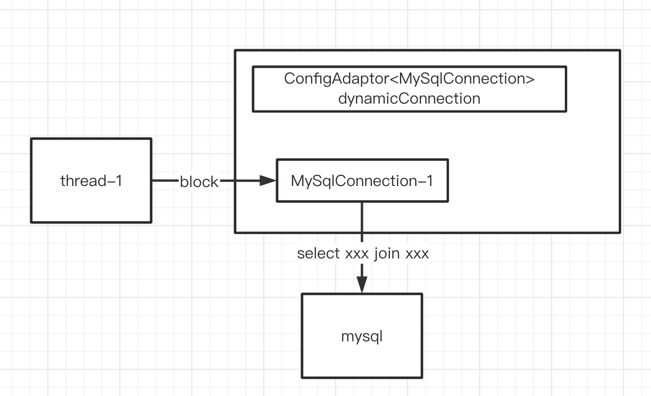
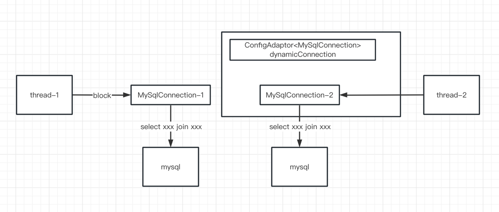
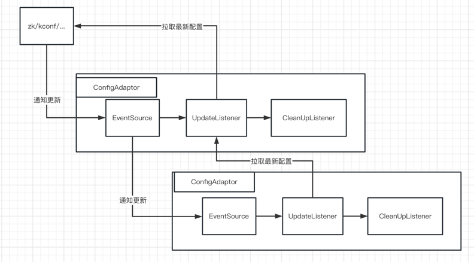
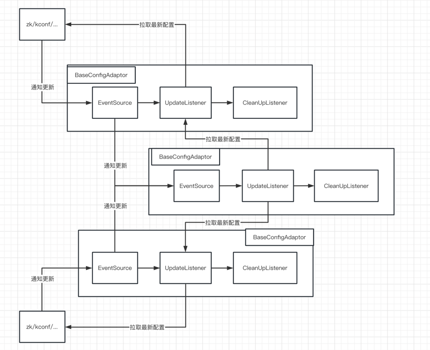

# ConfigAdapter -- 满足你对动态配置的一切幻想

## 简介

说到动态配置，大家一定不会陌生，我们在开发中有很多场景都会见到动态配置的身影。利用它我们可以动态调整白名单、开关等等，极大增加了服务的灵活性。我尝试给动态配置下一个定义：一个能够根据外界配置动态变更的字符串、整数或者特定类型的对象。在Java里，Supplier这个接口就很适合描述动态配置的行为。

```java
public interface Supplier<T> {
    T get();
}
```

比如，我们常用的动态配置系统Apollo，就可以封装成Supplier接口。

```java
import com.ctrip.framework.apollo.ConfigService;

Supplier<String> dynamicConfig = () -> {
  return ConfigService.getAppConfig().getProperty("some_config_key", "defaultValue");
}
```

每次调用get方法的时候，会返回当前Apollo平台上设置的值。通常我们在处理一个请求的时候，调用get方法，获取当前的配置（比如开关、白名单），然后进行下一步的处理。

如果我们想构造复杂一点的动态对象，最直观的想法是：从动态配置读取当前值，然后创建这个复杂对象。比如我们想要一个能动态调整限流qps的限流器RateLimiter，可能会想要这样实现（反例）：

```java
// 构造一个Supplier<Integer>，表示限流 qps
private static final Supplier<Integer> QPS_LIMIT_CONFIG = () -> {
    return ConfigService.getAppConfig().getIntProperty("rate_limiter_qps", 100);
};
// 希望构造一个可以动态调整限流 qps 的 RateLimiter，但是这样实现并不对
private static final Supplier<RateLimiter> DYNAMIC_RATE_LIMITER = () -> {
    return RateLimiter.create(QPS_LIMIT_CONFIG.get());
}
    
// 这个方法处理请求
public void onRequest() {
  // 先判断是否触发了限流
  if(!DYNAMIC_RATE_LIMITER.get().tryAcquire()) {
    // 后边再执行真正逻辑
    // ...
  } else {
    // ...
  }
}
```
这样实现的问题有两个：

1. 每次执行 DYNAMIC_RATE_LIMITER.get() 的时候都会创建一个新的 RateLimiter 对象，开销大 
2. 每次新建的 RateLimiter 对象并没有记录之前已经放过的请求，所以也无法实现限流的功能

那么我们该如何实现一个动态的RateLimiter呢？对了，就是使用ConfigAdapter！我们先用这个简单场景熟悉下 ConfigAdapter：

```java
import com.github.ymwangzq.config.adapter.core.SupplierConfigAdapter;

// 和之前一样，构造一个Supplier<Integer>，表示限流 qps
private static final Supplier<Integer> QPS_LIMIT_CONFIG = ...;

// 把这个 Supplier 包装成 ConfigAdapter
private static final ConfigAdapter<Integer> QPS_LIMIT = SupplierConfigAdapter.createConfigAdapter(QPS_LIMIT_CONFIG);

// 构造动态的 RateLimiter
private static final ConfigAdapter<RateLimiter> DYNAMIC_RATE_LIMITER = QPS_LIMIT.map(qps -> RateLimiter.create(qps));

// 这个方法处理请求
public void onRequest() {
  // 先判断是否触发了限流
  if (!DYNAMIC_RATE_LIMITER.get().tryAcquire()) {
    // 后边再执行真正逻辑
    // ...
  } else {
    // ...
  }
}
```
这就是一个功能正确的动态限流器了。和之前错误的实现不同，ConfigAdapter只有在配置发生变更的时候，才会创建一个新的 RateLimiter，每次执行 get() 方法时直接从内存中获取最近变更时构建出的 RateLimiter 对象，所以没有额外的开销，也能正确做到限流功能。

## ConfigAdapter 怎么用

增加依赖

```xml
<dependency>
    <groupId>io.github.ymwangzq</groupId>
    <artifactId>config-adapter-core</artifactId>
    <version>1.1.4</version>
</dependency>
```
## ConfigAdapter 能做什么
前面我们了解到，有一些场景，我们希望能有动态配置的能力，但实现起来不太方便；比如前边提到的RateLimiter。再比如用guava LoadingCache构建了一个本地缓存，希望能动态调整它的大小和过期时间；又或者我们构建了一个连接池，希望能动态调整连接池的大小、idleTimeout等参数；又或者需要构建一个可动态配置的 MySQL DataSource 等等。这些场景下，ConfigAdapter 是你的不二之选。

除此之外，ConfigAdapter 提供了很多更强大的功能，下边我来一一介绍一下：

### 动态资源的转换
其实在动态限流器的例子里，我们已经看到了，通过 ConfigAdapter<Integer> QPS_LIMIT 可以很容易构造出 ConfigAdapter<RateLimiter> DYNAMIC_RATE_LIMITER。这样的转换操作可以无限重复下去，没有任何的限制。举个例子：

```java
// 把这个 Supplier 包装成 ConfigAdapter
private static final ConfigAdapter<Integer> QPS_LIMIT = SupplierConfigAdapter.createConfigAdapter(QPS_LIMIT_CONFIG);

// 两倍 qps
private static final ConfigAdapter<Integer> DOUBLE_QPS_LIMIT = QPS_LIMIT.map(qps -> 2 * qps);

// 构造动态的 RateLimiter
private static final ConfigAdapter<RateLimiter> DYNAMIC_RATE_LIMITER = 
    QPS_LIMIT.map(qpsLimit -> RateLimiter.create(qpsLimit));

// 构造两倍 qps 的动态 RateLimiter
private static final ConfigAdapter<RateLimiter> DYNAMIC_DOUBLE_RATE_LIMITER = 
    DOUBLE_QPS_LIMIT.map(qpsLimit -> RateLimiter.create(qpsLimit));
```
这里构造出来所有的ConfigAdapter都可以独立工作。

### 动态资源的清理
上边 RateLimiter 的例子里，我们只关心配置变更后，新 RateLimiter 的创建，不关心老对象的清理和释放。因为 RateLimiter 本身并不需要做任何清理操作，直接等待释放引用后被GC回收即可。但如果是连接池、线程池这样的资源，不做清理的后果可能是：

1. 无法被GC回收掉 
2. 造成资源泄漏

所以对资源对象的清理工作是ConfigAdapter必须要面对的问题。那需要怎么使用清理功能呢？我们先看一下ConfigAdapter的接口定义：

（EventSource 是啥，为什么要继承 EventSource 接口我们后边会说，这里先忽略它）

```java
public interface ConfigAdapter<T> extends Supplier<T>, EventSource {
  /**
   * 获取配置内容
   */
  T get();

  /**
   * 将动态配置映射成新的动态配置/动态资源
   */
  <R> ConfigAdapter<R> map(@Nonnull ConfigAdapterMapper<? super T, R> configMapper);
}
```

可以看到map方法接受的是一个 ConfigAdapterMapper，我们再看下它的接口定义：

```java
public interface ConfigAdapterMapper<From, To> {
  /**
   * 动态配置变换逻辑
   */
  To map(@Nullable From from);

  /**
   * 清理逻辑
   */
  default void cleanUp(@Nullable To to) {
  }

  /* 其他接口暂时不需要关心，没有列出 */
}
```
它只有一个非default的方法，所以我们之前可以用lambda表达式来实现。要实现自动清理功能，我们可以通过@Override cleanUp 方法来清理资源。

#### 清理的时机
既然我们提供了清理资源的能力，那什么时候清理呢？为什么清理的时机需要单独拿出来介绍呢？我们考虑这样一种情况：ConfigAdapter<MySqlConnection> dynamicConnection 一个动态的 mysql 连接，在发现配置修改了mysql地址的时候需要重建新的连接，并关闭之前的连接。在00:00:00，用户请求经过 dynamicConnection.get() 拿到了 MySqlConnection-1，并开始执行一个巨耗时的 sql，需要执行5分钟；业务线程thread-1在等待这条sql的执行结果。这时的 dynamicConnection 内部状态大概是这样：



在00:00:01的时候，发生了mysql配置切换，dynamicConnection 内部拿到了新的配置创建出了新的连接。此后的用户请求都会在新的连接上执行。但是之前的连接上还在执行那个耗时5分钟的sql，所以这个时候老的连接还不应该被关闭。状态如下图。



那么什么时候才应该关闭 MySqlConnection-1 呢？可能是5分钟以后，等这条sql执行完，thread-0 请求成功返回以后，这时候关闭 MySqlConnection-1 最好。可是作为ConfigAdapter，并不知道这条sql要执行多久，那么有什么办法呢？

#### 1）固定delay清理
像上边的例子中，如果我们知道最耗时的sql需要执行5分钟，那么我们可以设定在配置更新成功后，等待5分钟再清理老资源。具体的方法是通过覆盖 ConfigAdapterMapper#delayCleanUpConfig 方法，来设定我们自己的 DelayCleanUpConfig。

```java
public interface DelayCleanUpConfig {
    // 需要传入一个用于延迟清理资源的线程池
    ScheduledExecutorService delayCleanUpExecutor();

    // 这里设置清理资源的延迟时间
    LongSupplier cleanUpDelayMs();
}
```

#### 2）基于GC的自适应清理
固定delay时间的清理机制还是有点不太能满足需求。因为即使切割配置的时候，老连接上没有在执行请求，也需要等固定的时间。反过来如果真实请求的执行时间比我们设置的delay要长，那请求还是会失败。有什么更好的办法么？有的！我们可以基于 GC 来做自适应的清理。

如果我们能确定需要清理的资源已经没任何引用，那肯定可以做清理工作了。关键是怎么确定没有引用了呢？很难做到；除非它已经被 GC 掉了。可是一旦资源已经被 GC 掉了，那我们还怎么做相应清理呢？

确实不行，但是我们有另一种思路：

我们在真正需要清理的资源对象外再包一层壳，壳对象把所有的方法调用都代理到内部真正的资源对象上。等壳对象没有引用了被 GC 掉的时候，就可以清理内部真正的资源了。看起来这个功能像是黑科技，不过是切实可行的，后边有机会可以单独用一篇文章介绍一下这里的实现。简单说这里使用了虚引用 PhantomReference，可以做到当一个对象被 GC 回收掉以后，执行回调逻辑；这里正是在壳对象被 GC 掉的回调逻辑里将资源对象清理的。

纯文字可能不太直观，这里贴一小段演示代码，这段代码摘自 ConfigAdapter 的测试用例；感兴趣的同学可以看 ConfigAdapter 的源码。

```java
import com.github.ymwangzq.config.adapter.facade.AdaptiveCleanUpProxy；

// 这是真实的资源对象
static class RealResource {
  // 这里搞一个 cleanup 方法被调用的计数器
  private static final AtomicInteger CLEAN_UP_COUNTER = new AtomicInteger(0);
  // 模拟一个根据配置内容变更的状态变量
  private final String configValue;

  public RealResource(String configValue) {
    this.configValue = configValue;
  }

  public String getConfigValue() {
    return configValue;
  }

  // 每当 cleanup 方法被调用的时候，就增加计数
  void cleanUp() {
    CLEAN_UP_COUNTER.incrementAndGet();
  }

  // 查看 cleanup 方法调用计数
  static int getCleanUpCounter() {
    return CLEAN_UP_COUNTER.get();
  }
}

// 壳对象
static class ResourceProxy extends RealResource implements AdaptiveCleanUpProxy<RealResource> {
  private final RealResource delegate;

  public ResourceProxy(RealResource delegate) {
    super(delegate.getConfigValue());
    this.delegate = delegate;
  }

  public RealResource getDelegate() {
    return delegate;
  }

  public String getConfigValue() {
    return getDelegate().getConfigValue();
  }

  public void cleanUp() {
    throw new UnsupportedOperationException();
  }
}

@Test
void testAdaptiveCleanUp() {
  // 这里模拟一个动态配置
  AtomicReference<String> configValue = new AtomicReference<>();
  // 将配置值设置为 v1
  configValue.set("v1");
  // 先创建一个简单 String 的 ConfigAdapter
  ConfigAdapter<String> dynamicConfigValue = SupplierConfigAdapter.createConfigAdapter(configValue::get);
  // 创建自适应清理的 ConfigAdapter
  ConfigAdapter<ResourceProxy> configAdapter = ConfigAdapters.createAdaptiveCleanUp(
    dynamicConfigValue,
    () -> new ResourceProxy(new RealResource(dynamicConfigValue.get())),
    resource -> Optional.ofNullable(resource).ifPresent(RealResource::cleanUp));

  RealResource resource = configAdapter.get();
  // 验证是 v1
  Assertions.assertEquals("v1", resource.getConfigValue());
  Assertions.assertEquals(0, RealResource.getCleanUpCounter());
  // 配置更新成 v2
  configValue.set("v2");
  // 这里等 2s 是因为 SupplierConfigAdapter 内部 1s 才检查一次更新，等 2s 为了保证完成了更新
  sleepUninterruptibly(2, SECONDS);
  // 验证是 v2
  Assertions.assertEquals("v2", configAdapter.get().getConfigValue());
  // 触发一次 GC
  System.gc();
  // 这里等 2s 是因为 GcUtil 里的清理线程没 1s 执行一次
  sleepUninterruptibly(2, SECONDS);
  // 验证这时 cleanup 方法没有被执行
  Assertions.assertEquals(0, RealResource.getCleanUpCounter());
  // 把 resource 引用释放掉，让壳对象可以被 gc
  resource = null;
  // 触发一次 GC
  System.gc();
  // 这里等 2s 是因为 GcUtil 里的清理线程没 1s 执行一次
  sleepUninterruptibly(2, SECONDS);
  // 这时 cleanup 方法被执行到了
  Assertions.assertEquals(1, RealResource.getCleanUpCounter());
}   
```
### 合并多个动态配置

还是以场景举例开始：我们以redis连接池这个资源为例。redis连接池里需要配置很多内容，包括redis 的 host & port、最大连接数、最大Idle数、最小连接数、连接空闲时间等。这些配置内容里，host & port 信息是由连接标识符维护和更新的；其他的连接数等参数，通常是由业务来自行选择的。所以在这个场景下，一个配置就被拆成了两个部分，分别由盘古平台和业务owner来配置和更新。任何一个地方变更的时候，就需要重建这个连接池。类似的场景其实还有很多。

怎么合并多个动态配置呢？还是贴一小段示例代码吧：

```java
ConfigAdapter<String> hostConfig = xxx;
ConfigAdapter<Integer> portConfig = xxx;

ConfigAdapter<HostAndPort> hostAndPortConfig = ConfigAdapters
        .mergeTwoConfigAdapters(hostConfig, portConfig, (port, host) -> HostAndPort.fromParts(host, port), merged -> { });
```

### 更新失败重试
还是以场景举例开始：我们之前的介绍中，都没有考虑配置变更过程中，创建新的资源失败的情况要怎么处理。默认情况下，如果根据新配置创建资源失败，那么还会继续用之前的资源对外提供服务，直到下一次配置变更。但是有些场景下，希望在创建资源失败的时候，不断进行重试。比如：mysql主库挂了，切主库的时候，头一次建连接失败了。这时候如果等待人工发现配置变更没有成功，再触发第二次切配置，通常时间已经过去很久了。在 ConfigAdapter 中支持了重试的功能，用起来大概是这样：
```java
// 创建一个重试配置
// 第一次重试间隔是1000ms, 以后每次重试的间隔都 * 2; 重试间隔最大到120_000ms; 无论重试抛出什么异常, 都继续重试下去
RetryConfig retryConfig = new RetryForever(2, 1000, 120_000, null);

// 用这个重试配置创建资源，每次 hostAndPort 有变更的时候，如果创建资源失败，会不断进行重试
ConfigAdapter<SomeResource> dynamicResource = hostAndPortConfig.map(UpdateWithRetryMapper.wrap(hostAndPort -> {
    return new SomeResource(hostAndPort);
  }, retryConfig));

```

## ConfigAdapter 的设计思路

把 ConfigAdapter 设计成能实现上述功能的强大组件，是一件非常有趣的事情。所以这里我想记录一下设计的思路。

动态配置，本质上是下边这些行为的集合：

1. 监听某个事件源（任何能告诉我们配置发生变化的东西，都可以认为是事件源；比如：Apollo、ZK、甚至一个轮询某个 redis key-value 是否变化的定时线程，都可以认为是一个事件源）
2. 收到变更通知的时候，读取最新的配置值，并根据读到的配置值构建资源对象
3. 清理旧对象

（这里有一些设计值得详细讨论，比如：为什么把事件源设计成只在发现变更的时候发起一次触发动作，新的配置内容需要事件监听者自己获取；而不是事件源直接把新的配置内容通知给监听者。后边准备单独先篇文章记录下这里对一致性的思考，现在就先不展开了。）

为了完整，我们也描述一下事件源的行为：

1. 可以添加/删除事件监听者
2. 像所有监听者发出通知

为了方便后边的理解，稍微贴一下实现代码的方法签名。

```java
public final class BaseEventSource implements EventSource {

  private final List<EventListener> eventListeners = new ArrayList<>();

  public void dispatchEvent(@Nonnull Event event) {
    /* 遍历 eventListeners, 调用 processEvent 方法 */
  }

  public void addEventListener(@Nonnull EventListener eventListener) { ... }

  public void removeEventListener(@Nonnull EventListener eventListener) { ... }
}
```

事件监听者的行为：在收到事件通知的时候，执行一段逻辑

```java
public interface EventListener {
  void processEvent(Event event);
}
```

有了这样的行为描述，我们大致可以知道构造一个动态配置需要哪些参数

```java
static ConfigAdapter<T> createConfigAdapter(EventSource eventSource, Supplier<T> fetcher, Consumer<T> cleanUp)
```

eventSource是需要监听的事件源，fetcher里边读取最新的配置值并根据配置值构建资源对象，cleanUp里边对旧的资源做清理。（当然这样的接口比较难用，通常我们直接用上文里封装好的方法，内部都是调用到这里）

接下来是整个设计里最有趣的地方之一：我们说事件源是一个能告诉我们配置发生变化的实体，那么 ConfigAdapter 本身不也可以作为事件源么？它能发现上游配置的变化，更新自己的资源对象，那也能作为下游的事件源。

同时 ConfigAdapter 的 get 方法也可以作为下游读取配置的地方，这就让 ConfigAdapter 具备了前面展示的动态资源转换能力，ConfigAdapter#map 方法就是借助这样的方式实现的。

```java
public <R> ConfigAdapter<R> map(@Nonnull ConfigAdapterMapper<? super T, R> configMapper) {
  return createConfigAdapter(this, () -> configMapper.map(this.get()), configMapper::cleanUp);
}
```
这样的map操作几乎可以无限地级联下去（由于受限于栈大小，也不是真正的无限，但是满足日常需求是绰绰有余了）。map 前后，ConfigAdapter 之间的关系如下图：


另一个有趣的地方是：eventSource 只负责通知监听者是否有变更，不负责通知变更的内容，变更后的内容由fetcher主动拉取。除了一致性方面的考虑，还带来了另一个重要的特性：我们可以很容易地将多个 eventSource 合并成一个 eventSource，只要有任何一个上游 eventSource 发出了通知，就认为有更新事件。这样ConfigAdapter就可以非常简单地做合并，支持上边提到的合并多个动态配置的功能。

合并多个EventSource大致像这样：
```java
// 构造一个新的 EventSource，新的 newEventSource 会在任意一个入参 eventSources
// 收到通知事件的时候向监听者发出通知
public static EventSource anyOf(EventSource... eventSources) {
    BaseEventSource newEventSource = new BaseEventSource();
    Stream.of(eventSources).forEach(eventSource -> 
        eventSource.addEventListener(event -> newEventSource.dispatchEvent(event));
    return newEventSource;
}
```
在此基础上合并多个 ConfigAdapter 的代码就不贴出来了，有太多的范型参数，还是在IDE里看更清楚。

合并以后的 ConfigAdapter 关系如下图：


感兴趣的同学可以直接看相关的源码，上边提到的核心逻辑可以在这几个类里看到实现：

1. com.github.ymwangzq.config.adapter.core.BaseConfigAdapter，ConfigAdapter 核心功能都在这
2. com.github.ymwangzq.config.adapter.core.EventSourceUtil#anyOf 合并多个eventSource
3. com.github.ymwangzq.config.adapter.core.ConfigAdapters#mergeTwoConfigAdapters 合并多个 ConfigAdapter

## ConfigAdapter 的防御性设计

除了提供上边的功能，ConfigAdapter 在避免异常使用带来的不良影响上也做了很多防御性设计。比如：

1. 通常我们会把 ConfigAdapter 构造好，存放到 static 变量里；但是如果用错了，不断在创建新的 ConfigAdapter，会发生什么？
2. 修改配置的时候改错了，使 ConfigAdapter 在构造新资源的时候卡住了（比如没有超时限制地在向一个错误的mysql地址发起连接，阻塞了更新线程），这时是否会影响 Apollo 的功能；重新把配置改对是否能让 ConfigAdapter 构造出正确的资源？
3. 上边一节里边我们看到了如果我们手动构造 ConfigAdapter（不是直接使用前面封装好的方法），可以手动传入 eventSource。那这里事件通知链上会不会被恶意or无意搞出环？

针对上边这些异常的用法，在 ConfigAdapter 里做了大量预防性的设计。

### 悬空对象的处理

这个预防性措施是为了应对错误使用造成不断创建ConfigAdapter对象的场景。通常我们一个对象没有引用了，就会被 GC 回收掉了。为什么这里要单独拿出来说呢？因为我们创建出来的 ConfigAdapter 除了我们自己在引用它，还有另外一条引用链路：事件通知链。为了能够在配置变更的时候收到变更通知，ConfigAdapter 必须把自己注册到事件源上，导致上游事件源会持有ConfigAdapter的引用。这样一来，即使我们在使用者的代码里释放了对ConfigAdapter的引用，它仍然无法被GC回收掉。还记得我们之前讲到过「基于GC的自适应清理」吗，这里也使用了类似的办法。使用者拿到的ConfigAdapter对象其实都是一个壳，在这个壳被GC回收掉的时候，会触发ConfigAdapter内部的清理逻辑：把自己从上游事件源上摘除，并清理自己内部持有的资源。这样，即使用户使用错了，在不断创建新的ConfigAdapter，也不会造成严重的内存or资源泄漏问题，不过性能肯定会比正确的用法差一些了。

### 永远不要阻塞通知线程

这个预防措施是为了避免创建资源的时候，线程被阻塞，造成对 Apollo、zk 造成影响。如果我们在 Apollo 的变更通知线程里直接创建资源，一旦线程被阻塞，那么会直接影响所有后续的动态配置更新，从而造成更大范围的影响。所以在ConfigAdapter中，非常注意对外部事件源通知线程的保护。比如在 SupplierConfigAdapter 中，检查配置是否变更的线程永远只做这一件事，一旦发现变更以后，立刻将后续的处理转发到独立的线程中执行，避免影响其他变更通知。其实这里和很多事件驱动的系统设计都很相似，比如使用netty的时候，就区分了两组线程，io线程专门处理io（其实就是保证事件能够得到及时响应），worker线程处理业务逻辑。

### 配置更新过程可以被中断

这个预防措施是为了避免错误的配置导致创建资源的线程被阻塞，之后修复配置却再也没有机会创建成功。举一个例子：mysql 连接池的配置，在一次更新时，把 host & port 填错了，同时又没有配置连接超时的时间。ConfigAdapter 收到这个错误的配置时，就开始建立连接，但是无法连上，又因为没有超时限制导致一直阻塞在这里。这时候，我们当然希望通过修复配置，让 ConfigAdapter 用正确的配置重新建立连接。这就需要在收到新配置的时候，能够中断正在进行中的资源创建。这里使用了 interrupt。这里可能是唯一一个适合用 interrupt 的场景。但是想把interrut用对真的很麻烦，最重要的事情在于，需要确定即将被 interrupt 的线程当前执行到了哪里，是否在我们预期的地方。如果被 interrupt 的线程正在执行一些不应该被 interrupt 的代码，那就麻烦了。这里比较复杂，后续有机会单独用一篇文章来介绍。

### 事件通知链路上的环检测

如果有人恶意 or 无意中把事件通知链路构造成了环，会发生什么呢？如果没有任何保护，这个环路上的所有 ConfigAdapter 都会不断收到更新事件，然后重新构造资源。有可能造成CPU很高，甚至无法被上边的中断机制处理，导致无法处理新的配置变更等问题。所以这里在分发事件的时候做了额外的保护。在 EventSource 实现中，使用了一个非 static 的 ThreadLocal 变量保存当前正在处理中的 event，事件完全处理结束后清理这个 ThreadLocal 变量。如果在分发事件的过程中发现这个 ThreadLocal 变量之前被设置过了，说明事件通知链上被搞出了环。目前对环的处理是：不再往下游发送变更事件，打破已有的环。关于环检测，还想到一个有趣的地方：我们都知道异常 Throwable 是可以获取 cause 的，相当于也是一个单链表，那这个链表上是否可能有环呢？有可能的。在 guava 里的 com.google.common.base.Throwables#getRootCause 方法里就使用了快慢指针做环检测。


